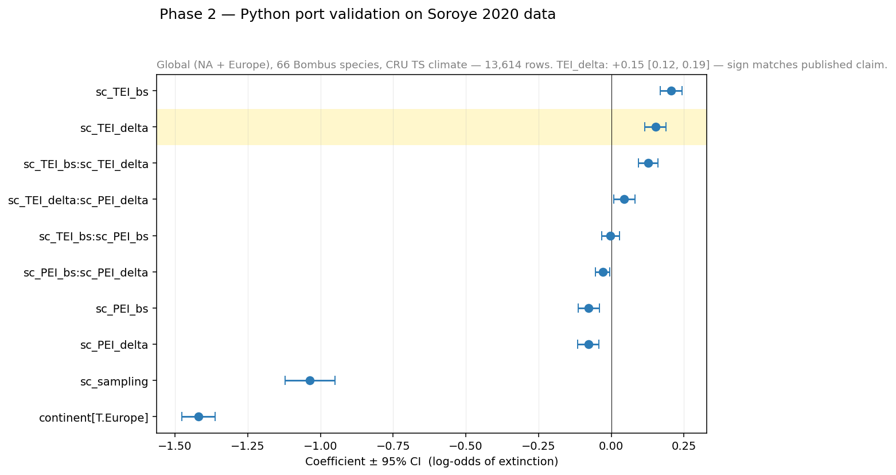

# Phase 2 — Reproduction on Soroye's data

Phase 2 asks: **does the Python re-implementation of Soroye's analysis
recover Soroye's published result, when applied to Soroye's own data?**

This is a *Robustness* check in FORRT vocabulary — same data, different
code, different statistical software stack. If the answer is no, the chain
stops here: the Python pipeline can't be trusted as a tool for Phase 3.
The answer is yes.

## What was changed

| Element | Soroye 2020 | This work |
|---|---|---|
| Language | R | Python 3.12 |
| Cleaning, presence/absence, sampling | five R scripts | five Python scripts (`soroye_port/01_*.py` through `soroye_port/05b_*.py`) |
| Mixed-effects logistic GLMM | `MCMCglmm` (Markov-chain Monte Carlo) | `statsmodels.BinomialBayesMixedGLM` (variational Bayes) |
| Data | Soroye's bundled *Bombus* + CRU TS 3.24.01 ([Figshare 10.6084/m9.figshare.9956471](https://doi.org/10.6084/m9.figshare.9956471)) | Same |
| Grid | 100 km cylindrical equal-area | Same |
| Periods | 1901–1974 baseline / 2000–2014 recent | Same |
| Model spec | extinction ~ continent + sampling + TEI/PEI baseline + delta + interactions + (1\|species) | Same |

## Headline result

```
sc_TEI_delta = +0.1528, 95 % CI [0.116, 0.189]   (mixed-effects, VB)
sc_TEI_delta = +0.2466, p = 4×10⁻²¹              (plain logit)
n = 13 614 species × cell observations across 66 Bombus species
```

Sign and significance match Soroye's published direction. The Python port
is validated.



The forest plot shows all fixed-effect coefficients and their 95 % credible
intervals. Beyond the headline `sc_TEI_delta`, note:
- `sc_TEI_bs` (baseline thermal position) is positive and significant —
  species near their warm range edge are more vulnerable.
- The hot-edge × thermal-change interaction `sc_TEI_bs:sc_TEI_delta` is
  also positive, consistent with Soroye's prediction.
- `sc_sampling` is negative and significant — more sampling effort means
  fewer flagged extinctions (a known confound, properly controlled for).

## The nanopubs

### Replication Study

<iframe src="https://platform.sciencelive4all.org/np/?uri=https://w3id.org/sciencelive/np/RADLcvxDglyzEnEfAo9e6RfnXQ_YK3v_gJcnWLVBkIbP4"
        width="100%" height="700" style="border:1px solid #ddd;border-radius:4px;"></iframe>

[View Phase 2 Study on Science Live →](https://platform.sciencelive4all.org/np/?uri=https://w3id.org/sciencelive/np/RADLcvxDglyzEnEfAo9e6RfnXQ_YK3v_gJcnWLVBkIbP4)

### Replication Outcome — Validated, High confidence

<iframe src="https://platform.sciencelive4all.org/np/?uri=https://w3id.org/sciencelive/np/RABeytsVYYMfRz_Jb3O__naWSg8Z63WTnQsofidkdrVvk"
        width="100%" height="700" style="border:1px solid #ddd;border-radius:4px;"></iframe>

[View Phase 2 Outcome on Science Live →](https://platform.sciencelive4all.org/np/?uri=https://w3id.org/sciencelive/np/RABeytsVYYMfRz_Jb3O__naWSg8Z63WTnQsofidkdrVvk)

### CiTO link to Soroye 2020

The Outcome `cito:confirms` Soroye et al. 2020. This nanopub records the
typed citation in machine-readable form and makes it eligible for
downstream import into Wikidata / Scholia via dedicated pipelines —
inclusion there is conditional on Wikidata's own notability criteria
and on the import being run.

<iframe src="https://platform.sciencelive4all.org/np/?uri=https://w3id.org/sciencelive/np/RAdvbQt3vXT0HpyNYdwwMBs8fVnmyv5KWFT0eXfVTDXg0"
        width="100%" height="500" style="border:1px solid #ddd;border-radius:4px;"></iframe>

[View Phase 2 CiTO on Science Live →](https://platform.sciencelive4all.org/np/?uri=https://w3id.org/sciencelive/np/RAdvbQt3vXT0HpyNYdwwMBs8fVnmyv5KWFT0eXfVTDXg0)

## Caveats

- Variational Bayes underestimates posterior credible-interval width by
  approximately 10–20 % relative to full MCMC. The point estimate is
  unaffected; only the CI bounds are conservative-shifted.
- The exact `climateLimits[[1]]/[[2]]` precomputation script that produces
  per-species hot/cold limits is not in Soroye's public Figshare release.
  We reconstructed it from the available R helper scripts. Sign and
  direction of TEI_delta are unaffected; absolute coefficient magnitudes
  may differ by a small constant from the original.

## What this enables

With the port validated on Soroye's data, the same scripts can now be
applied to *new* data — that's [Phase 3](phase3.md), where we run them on
open GBIF *Bombus* records for the Iberian Peninsula.
