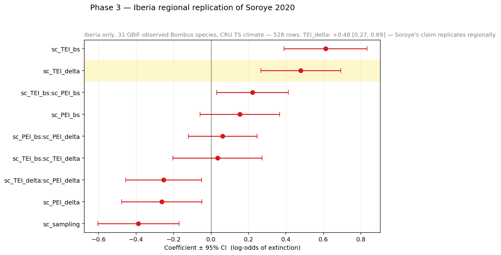

# Phase 3 — Iberian regional replication

Phase 3 asks: **does the same thermal-exposure → extirpation signal still
emerge when the curated continental dataset is replaced with open GBIF
occurrence records for the Iberian Peninsula?**

This is a *Replicability* check in FORRT vocabulary — same code (the
validated Python port from Phase 2), different conditions (regional zoom
to a southern-Europe subregion, different occurrence data source).

## Why Iberia

Many *Bombus* species reach their southern range limit on the Iberian
Peninsula. If Soroye's mechanism is real — that the *frequency* of
historically extreme temperatures, not mean warming, drives extirpation —
then Iberia is exactly where one would expect a *stronger* signal than
the continental mean. The Phase 3 result either supports that prediction
or it doesn't.

## What was changed

| Element | Phase 2 | Phase 3 |
|---|---|---|
| Occurrence data | Soroye's bundled continental dataset | Open GBIF *Bombus* for ES + PT, [10.15468/dl.3frmsq](https://doi.org/10.15468/dl.3frmsq) (36 560 records, 2026-04-25) |
| Climate | CRU TS 3.24.01 monthly | Same |
| Pipeline | weatherxbiodiversity Python port | Same (only `01_clean_data_iberia.py` differs from `01_clean_data.py`) |
| Grid, periods, model spec | unchanged from Phase 2 | unchanged |

## Headline result

```
sc_TEI_delta = +0.4792, 95 % CI [0.266, 0.693]   (mixed-effects, VB)
sc_TEI_delta = +0.2943, p = 0.007                (plain logit)
n = 528 species × cell observations across 31 Bombus species, 99 sampled cells
```

The claim **replicates regionally and with a stronger effect than the
continental mean**. The Iberian coefficient is approximately 3× larger in
magnitude than Phase 2's `+0.15` continental average.



Notable differences from Phase 2:
- `sc_TEI_delta` is *larger* (+0.48 vs +0.15).
- `sc_TEI_bs` is also larger (+0.61 vs +0.21) — Iberia is concentrated near
  the warm end of *Bombus* thermal envelopes.
- The hot-edge × thermal-change interaction (`sc_TEI_bs:sc_TEI_delta`) is
  positive but not significant on the smaller Iberian sample. This is most
  likely a sample-size / range-restriction effect rather than a real
  difference in the underlying mechanism.

## The nanopubs

### Replication Study

<iframe src="https://platform.sciencelive4all.org/np/?uri=https://w3id.org/sciencelive/np/RA51YMjEluCKKQWWIuB9_SBU88dgCaonVuqtS4CspPiUE"
        width="100%" height="700" style="border:1px solid #ddd;border-radius:4px;"></iframe>

[View Phase 3 Study on Science Live →](https://platform.sciencelive4all.org/np/?uri=https://w3id.org/sciencelive/np/RA51YMjEluCKKQWWIuB9_SBU88dgCaonVuqtS4CspPiUE)

### Replication Outcome — Validated, High confidence

<iframe src="https://platform.sciencelive4all.org/np/?uri=https://w3id.org/sciencelive/np/RAIylrhtnfTH_vtp1nTDVAiGsv2u_Ea4Uvh35DrGySuWs"
        width="100%" height="700" style="border:1px solid #ddd;border-radius:4px;"></iframe>

[View Phase 3 Outcome on Science Live →](https://platform.sciencelive4all.org/np/?uri=https://w3id.org/sciencelive/np/RAIylrhtnfTH_vtp1nTDVAiGsv2u_Ea4Uvh35DrGySuWs)

### CiTO link to Soroye 2020

<iframe src="https://platform.sciencelive4all.org/np/?uri=https://w3id.org/sciencelive/np/RApCQTLMP8h0jDYF9ggWU6lMTW7a_KG5_Jygbsx0aTpIo"
        width="100%" height="500" style="border:1px solid #ddd;border-radius:4px;"></iframe>

[View Phase 3 CiTO on Science Live →](https://platform.sciencelive4all.org/np/?uri=https://w3id.org/sciencelive/np/RApCQTLMP8h0jDYF9ggWU6lMTW7a_KG5_Jygbsx0aTpIo)

## Caveats

- Iberian sample size is small (528 species × cell observations) so credible
  intervals on individual coefficients are wider than on the continental
  Phase 2 dataset. The point estimate (+0.48) should be interpreted with
  this in mind.
- Variational Bayes posterior may underestimate credible-interval width
  by approximately 10–20 % relative to full MCMC.
- GBIF Iberian *Bombus* coverage before approximately 1920 is sparse, which
  reduces the temporal span of the effective baseline window relative to
  Soroye's continental dataset.

## What this enables

With Iberian replication confirmed, the same validated pipeline becomes a
*tool* — projecting onto future climate, identifying refugia, applying
the mechanism to other thermally-sensitive insect taxa. See [Discussion](discussion.md)
for what's next.
